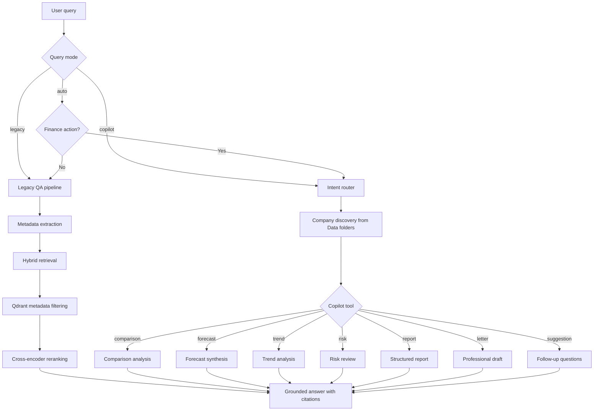
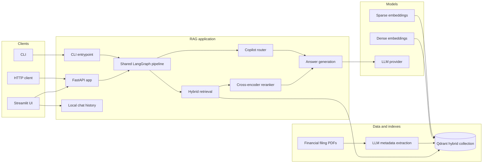

# Hybrid LangGraph RAG

This project implements a production-style financial copilot over PDF filings with hybrid retrieval, LLM-based metadata extraction, metadata filtering, cross-encoder reranking, and intent-based answer synthesis.

## Pipeline



## Architecture



## Modules

- `rag_app/config.py`: central runtime configuration from `.env`
- `rag_app/documents.py`: PDF discovery, metadata extraction, chunking
- `rag_app/vectorstore.py`: hybrid Qdrant indexing with dense and sparse vectors
- `rag_app/retrieval.py`: `extract_filters()` and `hybrid_search()`
- `rag_app/reranking.py`: `rerank_results()`
- `rag_app/copilot.py`: model-driven intent routing, dynamic company discovery, and compatibility-aware copilot flows
- `rag_app/chat_history.py`: persistent local conversation storage for the Streamlit chat sidebar
- `rag_app/generation.py`: `generate_response()`
- `rag_app/graph.py`: shared query pipeline orchestration
- `rag_app/api.py`: FastAPI app with health and query endpoints
- `rag_app/main.py`: CLI entrypoint

## Commands

Install dependencies:

```bash
pip install -r requirements.txt
```

Index documents into hybrid Qdrant:

```bash
python -m rag_app.main index
```

Run a CLI query:

```bash
python -m rag_app.main query "What did Amazon report in 2024?" --top-k 5 --mode auto
```

Run the API server:

```bash
uvicorn rag_app.api:app --host 0.0.0.0 --port 8000
```

Run the Streamlit UI:

```bash
streamlit run streamlit_app.py
```

The Streamlit UI includes:

- a GPT/Gemini-style left sidebar chat history
- a `New chat` button
- persistent local conversation storage
- the same `auto`, `legacy`, and `copilot` modes as the CLI/API

## API Endpoints

Health check:

```http
GET /health
```

Application query:

```http
POST /application/query
Content-Type: application/json

{
  "question": "Summarize Amazon annual report 2024 revenue and operating income",
  "top_k": 5,
  "mode": "auto"
}
```

The same request fields are available in the Streamlit UI:

- `question`
- `top_k`
- `mode`

## Chat History

Chat history is stored locally in `CHAT_HISTORY_DIR` by default, or in `./.chat_history` if the env var is not set.

Each conversation is saved as a JSON file so you can:

- switch between previous chats from the left sidebar
- continue older conversations after refresh
- start a fresh thread with `New chat`

## Config

Key `.env` settings:

- `EMBEDDING_MODEL`
- `SPARSE_EMBEDDING_MODEL`
- `OLLAMA_BASE_URL`
- `OLLAMA_FETCH_MODEL`
- `QDRANT_URL`
- `QDRANT_API_KEY`
- `COLLECTION_NAME`
- `RETRIEVAL_K`
- `HYBRID_FETCH_K`
- `RERANK_TOP_K`
- `RERANKER_MODEL`
- `QDRANT_HYBRID_FUSION`
- `UPLOAD_BATCH_SIZE`
- `QDRANT_TIMEOUT_SECONDS`
- `QDRANT_UPSERT_RETRIES`
- `GROK_MODEL`
- `GROK_API_KEY`
- `GROQ_BASE_URL` or `GROK_BASR_URL`
- `PDF_DATA_DIR` or `DATA_BASE_DIR`
- `CHAT_HISTORY_DIR`
- `ENABLE_RERANKING`

## Response Shape

The query API now returns:

- `intent`
- `answer`
- `citations`
- `extracted_filters`
- `search_query`
- `suggestions`
- `matched_companies`

## Example Prompts

Use these prompts to hit each copilot tool cleanly.

### LetterDraftTool

- "Draft a professional investor update email about Amazon's quarterly performance."
- "Write a concise email summarizing Apple's latest filing for the finance team."
- "Create an internal memo explaining Meta's key business highlights and risks."

### ForecastTool

- "Forecast Apple's revenue for the next quarter."
- "Predict Google's operating income trend over the next two quarters."
- "Forecast Amazon's future growth under conservative and bullish scenarios."

### TrendTool

- "Analyze Meta's revenue trend over the last four quarters."
- "What pattern do you see in Apple's operating margin over time?"
- "Explain the quarterly performance trend for Google."

### SuggestionTool

- "What should I ask next after reviewing Amazon's annual report?"
- "Suggest the best follow-up questions for Apple's latest filing."
- "What are the next useful questions I should ask about Google?"

### ReportTool

- "Generate a full financial report for Meta."
- "Create a structured summary report for Amazon's latest filing."
- "Prepare an executive-style report comparing Apple and Google."

### RiskTool

- "Identify the key financial risks in Amazon's latest filing."
- "What are the major warning signs in Apple's business performance?"
- "Highlight the biggest risks and weaknesses in Meta's quarterly report."

### ComparisonTool

- "Compare Apple and Google and give me the key insights."
- "Compare Amazon and Meta from a financial performance perspective."
- "Do a side-by-side comparison of Apple, Google, and Meta."

## Compatibility Mode

To preserve the original RAG behavior, the app supports query modes:

- `auto`: uses legacy retrieval/generation for normal Q&A, and the copilot path for explicit finance actions like comparison or forecasting.
- `legacy`: forces the original pipeline exactly as before.
- `copilot`: forces the new intent-based copilot flow.

The copilot router first checks whether the question clearly matches one of the seven finance tools:

- comparison
- forecast
- trend
- risk
- report
- letter
- suggestion

If it does not match one of those tools, the app falls back to the legacy QA strategy.

CLI example:

```bash
python -m rag_app.main query "What did Amazon report in 2024?" --mode legacy
```

API example:

```json
{
  "question": "What did Amazon report in 2024?",
  "top_k": 5,
  "mode": "legacy"
}
```

## Notes

- `auto` mode keeps the original Q&A flow for normal filing questions.
- The copilot router uses the data folders under `Data/` to discover which companies are available.
- Re-run `python -m rag_app.main index` after changing hybrid vector settings or metadata index strategy.
- The reranker model may download on first use.
- The Ollama embedding model must be available locally for indexing and dense retrieval fallback.
